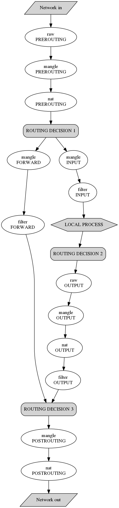

# Iptables network packet flow in Graphviz

This is a network packet flow trough [Iptables][1] tables and chains graphed in
[Graphviz][2] open source graph visualization software. See
[Traversing of tables and chains][3] chapter in *"Iptables Tutorial"*
book by Oskar Andreasson for full details.

Image is generated by the following command:

```dot -T png -o iptables-packet-flow.png < iptables-packet-flow.gv```



> **Note:**  [Iptables Tutorial][4] has not been updated for quite a while.

[1]: https://netfilter.org/projects/iptables/index.html "Iptables project"
[2]: https://graphviz.gitlab.io "Graphviz – open source graph visualization software"
[3]: https://www.frozentux.net/iptables-tutorial/iptables-tutorial.html#TRAVERSINGOFTABLES "Iptables: Traversing of tables and chains"
[4]: https://www.frozentux.net/iptables-tutorial/iptables-tutorial.html "Iptables Tutorial book by Oskar Andreasson"
